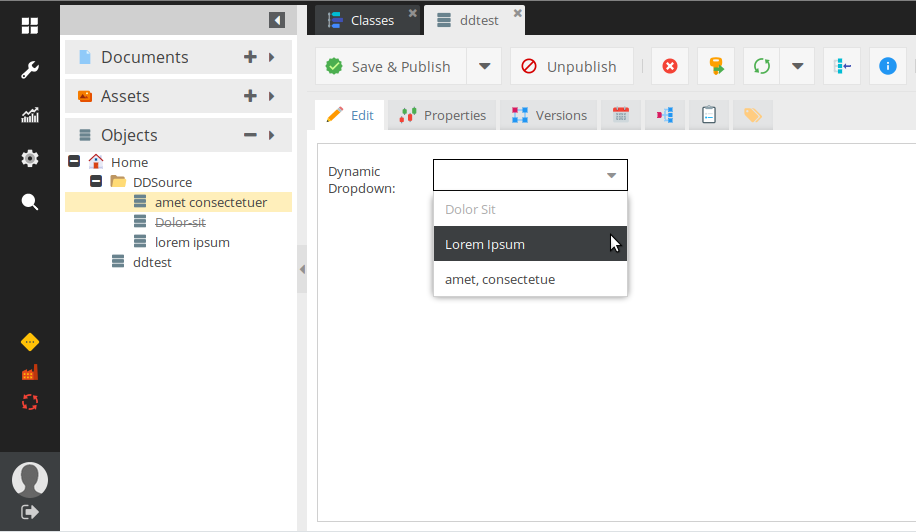
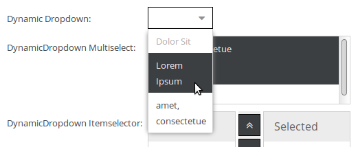
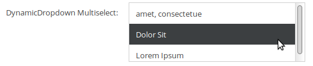
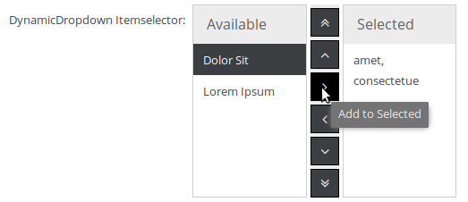
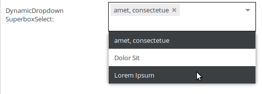
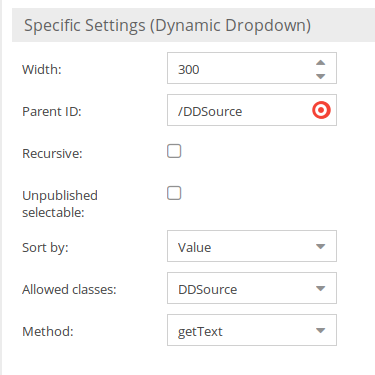
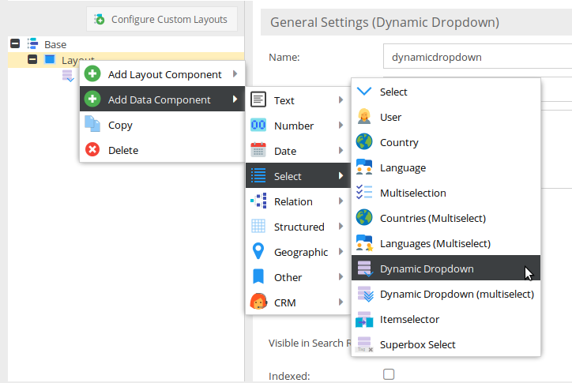

# Pimcore - Dynamic Dropdown

[](https://packagist.org/packages/thomas-keil/dynamic-dropdown)  [](https://packagist.org/packages/thomas-keil/dynamic-dropdown)

Dynamic Dropdown allows you to populate pimcore input fields with the content of other objcts.



## Getting started

* Download Plugin and place it in your plugins directory
* Open Extension Manager in Pimcore and enable/install Plugin
* After Installation within Pimcore Extension Manager, you have to reload Pimcore

or install it via composer on an existing pimcore installation

```
composer require thomas-keil/dynamic-dropdown
```

## Configuring

The plugin doesn't require any configuration but provides several input elements.
These input fields can be configured like any other of pimcore's input elements.

## Usage

The plugin extends pimcores class data compent menu in the section "Select".
Four new elements can be used:

* Dynamic Dropdown: a single select dropdown menu
  

* Dynamic Dropdown (multiselect): a box with several items to select. Select one
  by clicking it, all other will be deselected. Hold the CTRL-key while clicking
  to add the item without deselecting the others.
  
  
* Itemselector: the items are displayed in two columns, on the left are the available
  (or remaining) items, on the right are the selected ones.
  Transfer to the other column by doubleclicking or using the left/right arrow button.
  Up/down arrow buttons arrange the order.
  
    
* Superbox Select: Like a "tag field". Select one item and it get's displayed,
  click the little "x" next to it to remove it.
  
    
### Options

The options for all input elements are the same, only the way the information is
presented differes.



Following options need to be set:

* Width: the width of input element
* Parent ID: the path to the folder containing the source objects. You can use drag&drop
* Recursive: check this if objects in subfolders shall be used as well
* Unpublished selectable: usually unpublished objects will be displayed in the item list, but be of a grey color and unselectable. Check this if you want unpublished objects to be selectable. This option is currently only used by the single select dropdown!
* Sort by: either "Value" or "Id". By value is alphabetically ascending, by Id is numerically ascending by pimcore's object id.
* Allowed classes: the object class, that provides the data. Only objects of this class we be considered, all others will be ignored.
* Method: the method that provides the data. The possible methods are extracted from the class definition of the source class.


### Dynamic Dropdown



The Dynamic Dropdown is the "classic" version of the provided input elements:
a dropdown input field (ExtJS: Combobox). Every option is provided by an object
in a configured folder, by a configured method.
The folder can have nested subfolders, but only one type of object class can provide
the data.

This input element extends pimcore's [href](https://www.pimcore.org/docs/latest/Objects/Object_Classes/Data_Types/Relation_Types.html) element. 
Programatically, you can set it's value with the API like you'd do with a href.

### Dynamic Dropdown (multiselect)

The multiselect Dynamic Dropdown is like the single select version, but you can select 
more than one item. It uses [ExtJS' UX MultiSelect](http://docs.sencha.com/extjs/6.0.2/classic/Ext.ux.form.MultiSelect.html).
It extends pimcore's multiselection. Setting it with the API is like working with a
multiselection.

### Itemselector

The Itemselector is like the Multiselect, but uses the [ItemSelector](http://docs.sencha.com/extjs/6.0.2/classic/Ext.ux.form.ItemSelector.html)
as UI element.

### SuperboxSelect

The SuperboxSelect is like the Multiselect, but uses the [TagField](http://docs.sencha.com/extjs/6.0.2/classic/Ext.form.field.Tag.html)
as UI element.

## Example

```
use Pimcore\Model\Object;
  
$myHrefElement = Document::getById(23);
$myOtherHrefElement = Document::getById(23);
 
$myMultihrefElements[] = $myHrefElement;
$myMultihrefElements[] = $myOtherHrefElement;
 
$myObjectsElements[] = Object\Product::getById(98);
$myObjectsElements[] = Object\Product::getById(99);
 
$object->setDynamicDropdown($myHrefElement);
$object->setDynamicDropdownMultiple($myMultihrefElements);
$object->setItemselector($myMultihrefElements);
$object->setSuperboxSelect($myMultihrefElements);
 
$object->save();
```